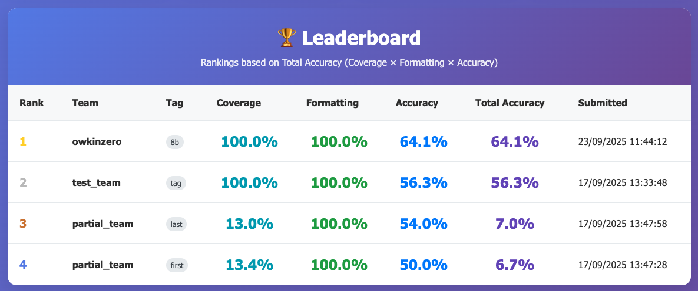

# Decoding Biology Hackathon Platform

This folder contains all the tools and resources needed for participants to start hacking Biology.

## 🚀 Quick Start

1. **Download the train set ground truth:**
   
   If the data is not already downloaded, you can find it on the bucket:
   ```bash
   # Look through bucket
   aws s3 ls s3://decoding-biology-hackathon-test-data/data/
   # Copy files
   aws s3 sync s3://decoding-biology-hackathon-test-data/data/ .
   ```
2. **Install dependencies:**

   Create a virtual environment and install all dependencies (via `uv`):
   ```bash
   bash install.sh
   ```

3. **Start the vLLM server (once per team):**

   Start your own inference endpoint.
   ```bash
   bash start_vllm_docker.sh
   ```
   This will start a local LLM endpoint for you and your team, that you can access from e.g. localhost:8000 (check the contents of `start_vllm_docker.sh`).

## 📁 Files Overview

### Core Notebooks
- **`vllm_demo.ipynb`** - Demo notebook showing how to use the vLLM server
- **`smolagents_demo.ipynb`** - Demo notebook for using [SmolAgents](https://huggingface.co/docs/smolagents/en/index). This might be a good solution to call python code and use the output to answer Q&A questions.
- **`generate_answers_demo.ipynb`** - Demo notebook for using the vLLM server to generate a submission.

### Scripts
- **`upload_answers.py`** - Script to validate and upload JSONL files to S3

### Configuration
- **`pyproject.toml`** - Python dependencies
- **`install.sh`** - Installation script
- **`start_vllm_docker.sh`** - Script to start the vLLM Docker container

### Uploading Answers

The expected format of the answers is a JSONL file with the following fields:

```json
{
  "question": "Is G3BP1 druggable with monoclonal antibodies?", # From the original data
  "options": "{\"A\": \"No\", \"B\": \"Yes\"}", # From the original data
  "answer_letter": "A", # Response extracted from the model's raw_response
  "raw_response": "<think>...</think><answer>A</answer>" # Optional, but better to include it
}
```
With one line per question.

You need to provide the original question and options from the original datasets, as they are used for looking up the correct answer (the order does not matter).

Including the raw_response is optional to be on the leaderboard, **but we will ask the winning team to provide it.**
In other words, we will only consider full submissions with the raw_responses for the leaderboard prize.

You can use the following script to upload your answers to the **test set**:
```bash
# Validate only
uv run python upload_answers.py test_answers.jsonl --team-name "team1" --validate-only

# Upload 
uv run python upload_answers.py test_answers.jsonl --team-name "team1"

# Upload with team name and tag (e.g., model name)
uv run python upload_answers.py test_answers.jsonl --team-name "team1" --tag "qwen3_8b_no_tooling"

# Check S3 connection
uv run python upload_answers.py --check-s3
```
### Viewing the Leaderboard

The leaderboard available at https://d2tzswkhcugild.cloudfront.net/

The total score is the percentage of the test set that has a correctly formatted answer and is also correct.


## 📊 Data Format

The provided data has the following format:

### Input Training set Questions (hackathon-train.json)
```json
{
  "question": "Is G3BP1 druggable with monoclonal antibodies?",
  "options": "{\"A\": \"No\", \"B\": \"Yes\"}",
  "answer": "A",
  "question_type": "antibody",
  "metadata": "{\"target_protein\": \"G3BP1\", \"original_question\": \"Target X can be targeted by Monoclonal Ab ?\", \"original_answer\": 0, \"answer_type\": \"binary\", \"question_category\": \"subquestion 6\", \"template_used\": \"Is {target} druggable with monoclonal antibodies?\", \"data_row_index\": 70}",
  "dataset_name": "Therapeutic Target Profiling"
}
```
### Input Test set Questions (hackathon-test.json)
```json
{
   "question": "Based on phenylbutazone (computed as the average activity of: CYP2C19, NR1I2, CYP2D6, CYP3A4, TP53, ESR2, EHMT2, CYP2C9, MCL1, PTGS2, and 6 more genes) signature activity patterns from bulk RNA-seq data, which cancer type is more similar to Pheochromocytoma and Paraganglioma?",
   "options": "{\"A\": \"Ovarian serous cystadenocarcinoma\", \"B\": \"Prostate adenocarcinoma\"}",
   "question_type": "cancer_similarity_binary",
   "metadata": "{'options': array(['OV', 'PRAD'], dtype=object), 'signature': 'phenylbutazone', 'split': 'test', 'subject': 'PCPG'}",
   "dataset_name": "TCGA Cancer Similarity"
}
```

## 🔍 Troubleshooting and best practices

### Common Issues

1. **vLLM Server Not Running**
   ```bash
   # Check if Docker is running
   docker ps

   # Check the GPU usage
   nvidia-smi
   
   # Start the server
   ./start_vllm_docker.sh
   ```

   If you want to start fresh, you can kill **all** docker processes and all python processes running on the GPU. **This will kill the processes for everyone on your team.**:
   ```bash
   pkill -f "docker"
   # Kill all processes running on the GPU
   nvidia-smi | grep 'python' | awk '{ print $3 }' | xargs -n1 kill -9

   # Check again nvidia-smi, GPUs should be free
   nvidia-smi
   ```

3. **File Not Found Errors**
   - Ensure `hackathon-train.json` is in the current directory
   - Check file paths in the notebook

4. **Answer Format Issues**
   - You can ask the LLM to format its answer as `<answer>[letter]</answer>` where letter is A, B, C, D, etc, then use a regex like shown in `generate_answers_demo.ipynb` to extract the answer. Bear in mind that the LLM might not always follow the format, you may need to do prompt engineering.
   - You just need to include the answer letter in the jsonl responses file. Make sure that it corresponds to one of the original options.

## 🎯 Best Practices

1. **Encourage test time compute**: Several studies have shown that LLMs can improve their performance with test time compute. You can encourage this by adding a prompt like "Think through the question step by step", or "First define each biological concept and then answer the question" etc...
2. **Choosing the right model**:
    - You do not have to use vLLM for inference. You can use any system that you like. Feel free to query your favorite assistant to get a list of models that you can run on the available resources (8xL4 GPUs, 192Go VRAM).
    - Some models are already finetuned on adjacent domains, e.g. [MedGemma](https://huggingface.co/google/medgemma-27b-text-it)
    - You can also look into larger quantized models that are published on Hugging Face (e.g. https://huggingface.co/models?other=base_model:quantized:openai/gpt-oss-120b).
   
3. **Post-training**: You can use the training set to try to fine-tune open-weights models, probably up to 32B with [LoRA](https://huggingface.co/docs/peft/main/en/conceptual_guides/lora). Unfortunately, the resources will not be enough to do reinforcement learning.


Good luck with your submissions! 🧬🏆
